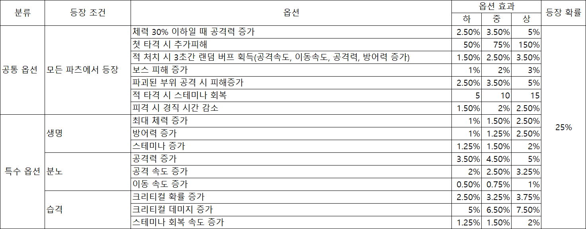

# 파츠 시스템

내가 작성한 기획서를 HTML 형식의 GDD파일로 만드는 프롬프트를 짜줘.

현재는 2. 시스템까지만 작성해주고
목차 3,4는 레이아웃만 잡아줘.

# 파츠 시스템

## 목차

1. 개요
2. 시스템
3. UI/UX
4. 테이블

1. 개요
    
    1.1. 시스템 개요
    
    | 분류 | 내용 |
    | --- | --- |
    | 시스템명 | Project:RAID 파츠 시스템 |
    | 한줄 정의 |  |
    | 게임 | Project:RAID |
    | 장르 | 헌팅 액션 RPG |
    
    1.2. 기획 의도
    
    - 유저 관점
        - 전투에 필요한 능력을 추가로 얻어 전투력을 강화합니다.
        - “내용을 토대로 너가 아래 내용을 토대로 작성해줘”
    - 사업 관점
        - 핵심 수익원으로서 골드 소모 → 골드 구매 전환을 유도
        - “추가로 너가 더 작성해줘”

1. 시스템
    
    2.1. 파츠
    
    - 캐릭터의 스펙을 올려주는 주요 악세사리 아이템이나 착용 시 외형 변화는 없습니다.
    - 무기에 장착할 수 있는 악세사리입니다.
        - 무기에는 총 3개의 파츠 슬롯이 존재합니다.
            - 생명 슬롯
            - 분노 슬롯
            - 습격 슬롯
    - 파츠의 옵션은 주 옵션과 부가 옵션(2종)로 나뉩니다.
    - 파츠의 옵션은 다음과 같이 정해진다.
        
        
        
        - 주 옵션: 특수 옵션 중 1종
        - 부가 옵션: 특수 옵션 + 공통 옵션 (2종)
            - 동일한 파츠에 옵션이 중복해서 등장하지 않습니다.
        
    - 파츠 흭득 경로
        - 상점 파츠 뽑기에서 뽑기 전용 재화를 사용하여 획득할 수 있습니다.
        - 파츠 뽑기에 관한 상세 내용은 “파츠 뽑기 시스템 기획서”를 참고
    - 파츠 뽑기 전용 재화를 이용하여, 확률적으로 아이템을 얻는 시스템
    
    2.2. 성장 구조
    
    2.2.1. 파츠 등급
    
    - 파츠 등급에 따라 옵션 개수 및 최대 성장 수치가 달라집니다.
        
        
        | 등급 | 색상 | 옵션 구성 | 특징 |
        | --- | --- | --- | --- |
        | 일반 | 회색 | 주 옵션 1개 | 초반 성장용 |
        | 고급 | 녹색 | 주 옵션 1개 + 부가 옵션 1개 | 기본 파밍 단계 |
        | 희귀 | 파랑 | 주 옵션 1개 + 부가 옵션 2개 | 본격 세팅 시작, 하급 옵션 등장 |
        | 영웅 | 보라 | 주 옵션 1개 + 부가 옵션 2개 | 중급 옵션까지 등장 |
        | 전설 | 주황 | 주 옵션 1개 + 부가 옵션 2개 | 상급 옵션까지 등장 |
    - 기획 의도
        - 낮은 등급은 성장 체험 제공
        - 높은 등급은 세팅 완성 목표 제공
        - 희귀 이상부터 실질적인 빌드 세팅 가능
    
    2.2.2. 옵션 등급
    
    - 옵션 수치는 “하 / 중 / 상”단계로 구분됩니다.
    - 옵션 등급은 파츠를 획득하여 옵션이 부여될 때, 옵션의 등급이 정해집니다.
    - 옵션 등장 확률
        - 고급 ~ 희귀 파츠
            
            
            | 등급 | 확률 |
            | --- | --- |
            | 하 | 100% |
        - 영웅 파츠
            
            
            | 등급 | 확률 |
            | --- | --- |
            | 하 | 70% |
            | 중 | 30% |
        - 전설
            
            
            | 등급 | 확률 |
            | --- | --- |
            | 하 | 50% |
            | 중 | 30% |
            | 상 | 20% |
    
    2.2.3. 파츠 강화
    
    - 파츠 강화란?
        - 파츠는 강화를 통해 옵션 효율을 상숭시킬 수 있습니다.
            - 강화 최대 6번까지 강화할 수 있습니다.
            - 강화 진행 시 주 옵션과 부가 옵션 1종의 수치가 증가합니다.
                - 예시 이미지
                    
                    
                    
        - 강화 재화
            - 골드
            - 파츠 강화 소재
    
    - 강화 성공 단계
        - 강화 성공 단계란?
            - 강화를 진행하였을 때(강화 버튼 클릭 시)
        - 강화 성공 단계는 총 5단계로 이루어져 있습니다.
            - 일반
            - 고급
            - 희귀
            - 영웅
            - 전설
        - 강화 성공 단계는 주 옵션과 부가 옵션 1종 함께 반영됩니다.
        - 각 성공 단계에 따라 추가 상승되는 수치가 다릅니다.
            
            
            
        
    - 강화 재시도
        - 강화를 진행한 후 강화 재시도를 통해 2회에 한해 재도전할 수 있습니다.
            - 강화 재시도는 현 강화 단계의 직전 단계로만 강화가 가능합니다.
            - 예시)
                - 현재 강화가 6강이고, 재도전의 기회가 있는 경우
                    - 5강 → 6강의 강화를 다시 진행할 수 있습니다.
                    - 4강 → 5강의 강화는 진행할 수 없습니다.
                - 현재 강화가 6강이고, 재도전의 기회가 없는 경우
                    - 강화를 다시 진행할 수 없습니다.
    
    - 기획 의도
        - 과도한 스트레스 방지
        - 강화 재시도 기능을 통한 리텐션 유지
        - 안정적인 재화 소비처 제공
    
    2.2.4. 뽑기
    
    - 파츠 뽑기 시스템 기본 원칙
        - 파츠 뽑기는 뽑기 전용 재화를 사용합니다.
        - 뽑기 전용 재화(뽑기권) 1개로 파츠 1개와 교환합니다.
        - 아이템은 오직 파츠만 포함합니다.
            - 파츠의 종류
                - 생명의 파츠
                - 분노의 파츠
                - 습격의 파츠
        - 파츠는 뽑기는 정해진 풀에서 확률적으로 획득합니다.
            - 무기 파츠 뽑기권: 파츠의 구분없이 모든 파츠가 등장
            - 생명의 파츠 뽑기권: 생명의 파츠만 등장
            - 분노의 파츠 뽑기권: 분노의 파츠만 등장
            - 습격의 파츠 뽑기권: 습격의 파츠만 등장
    - 뽑기 전용 재화
        - 기본규칙
            - 파츠 뽑기는 파츠 뽑기 전용 재화를 사용합니다.
                - 재화의 종류를 구별해 단순화하기 위함
            - 유저가 보유한 파츠 뽑기 전용 재화는 인벤토리의 자원 목록에서 출력합니다.
            - table_Currency에 신규 타입 추가
                - AllPartsTicket
                - LifePartsTicket
                - FuryPartsTicket
                - AssaultPartsTicket
        - 획득
            - 상점
                - 골드로 구매
                    - 골드 500당 1뽑기권
                - 쿠폰으로 구매
            - 이벤트 보상
            - 배틀패스 보상